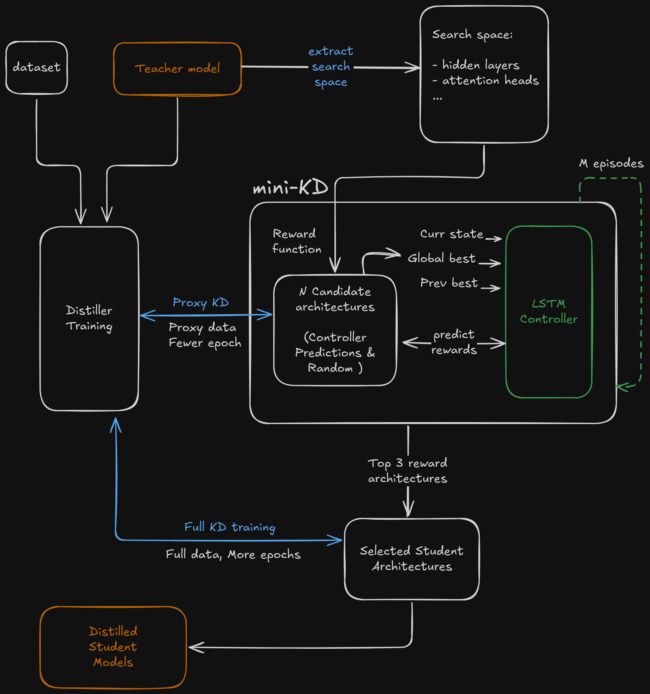
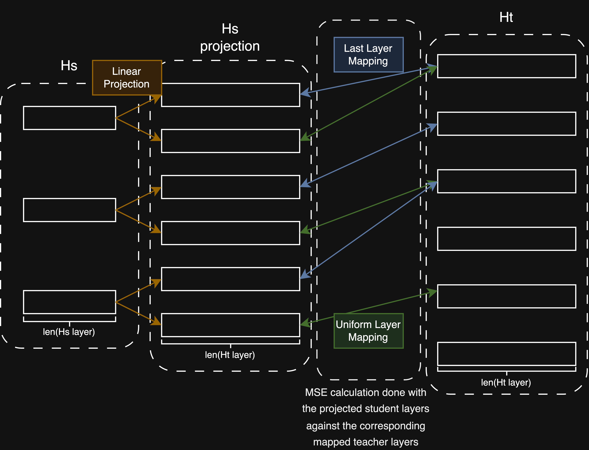

# KD-NAS: Automated Knowledge Distillation with Neural Architecture Search for Language Models

## Overview

This project implements **KD-NAS**, a framework for automating the discovery of efficient student model architectures for language model compression via knowledge distillation (KD). The core contribution is an efficient **Neural Architecture Search (NAS)** pipeline that explores, evaluates, and selects optimal student configurations based on both performance and latency.

The KD component uses hidden state distillation, while the NAS component supports two strategies:
1.  **Optuna-based optimisation:** Uses the TPE sampler for Bayesian optimisation of architectures.
2.  **Reinforcement Learning (RL) based LSTM Controller:** Trains an LSTM network to predict rewards of candidate architectures based on past performance.

A latency-aware reward signal guides the search process, balancing the trade-off between model accuracy (proxied by distillation loss) and inference speed.

## Main Features

*   **Automated Architecture Search:** Discovers student model architectures using NAS.
*   **BERT-like Model Support:** Compatible with teacher/student models from the BERT family (e.g., BERT, RoBERTa). 
*   **Flexible NAS Strategies:** Offers both Optuna (TPE) and an RL-based LSTM controller for architecture search.
*   **Efficient Proxy Evaluation:** Uses "mini-KD" on a data subset for faster architecture evaluation during NAS.
*   **Hidden State Distillation:** Implements hidden state matching (Uniform+Last mapping) with a trainable linear projection for KD.


*Figure 1: High-level overview of the KD-NAS pipeline with the LSTM controller.*

## Installation and Usage

1.  Clone the repository
2.  Install dependencies:
    ```bash
    pip install -r requirements.txt
    ```
    *(Ensure compatible PyTorch version with CUDA support installed for using GPU.)*

**Example Usage**

This command runs NAS using the LSTM controller on the `imdb` dataset with `roberta-base` as the teacher. It performs 15 episodes of search and saves the top 10 best-performing architectures found (based on the reward) to the output directory without performing full final training.

```bash
python kd_nas.py \
    --search LSTM \
    --teacher FacebookAI/roberta-base \
    --dataset imdb \
    --lstm_episodes 15 \
    --output_dir ./results/roberta_imdb_lstm_nas \
    --nas_only
```

Refer to [README](kd/README.md) for more detail.

## Workflow overview

The KD-NAS pipeline follows these steps:

1.  **Setup & Data Preparation:**
    * Loads the specified dataset (e.g., `imdb`, `wiki_text`) and the teacher model's tokenizer.
    * Tokenizes the data and prepares DataLoaders for full training, proxy training (for NAS evaluation), and consistent latency measurement.

2.  **Teacher Model Preparation:**
    * Loads the pre-trained teacher model (e.g., `bert-base-uncased`).
    * Freezes the teacher's weights (used only for inference during KD).
    * Measures and records the teacher's baseline inference latency for reward calculation.

3.  **Search Space Definition:**
    * Automatically defines the search space for student architectures (e.g., ranges for `num_hidden_layers`, `hidden_size`, `num_attention_heads`, `intermediate_size`) derived from the teacher model's configuration. (WIP)

4.  **Neural Architecture Search (NAS):**
    * Executes the chosen search strategy (`Optuna` or `LSTM`).
    * **Iteratively:**
        * The NAS controller/optimiser proposes a candidate student architecture config.
        * A student model is constructed based on this config.
        * **Proxy Evaluation:** The student undergoes a short "mini-KD" training phase on a smaller proxy dataset, learning from the frozen teacher via hidden state distillation.
        * The student's inference latency is measured.
        * A **reward** is calculated based on the mini-KD performance (loss) and the measured latency, aiming to balance accuracy and speed. \
        $\text{reward} = (1 - \text{loss}_{MSE}) \times (\frac{\text{latency}_S}{\beta \times \text{latency}_T})^\alpha$ \
        (where $\alpha$ controls latency penalty and $\beta$ scales the target latency relative to the teacher).
        * The NAS controller/optimizer uses this reward to guide the search for better architectures in subsequent iterations.

5.  **Result Collation:**
    * After the NAS process completes (after a set number of trials or episodes), all evaluated architectures and their corresponding metrics (config, reward, loss, latency, size) are collected.
    * Results are sorted by the calculated reward score (higher is better).

6.  **Final Output:**
    * **If `--nas-only` is specified:** Saves the configs and performance metrics of the top N discovered architectures to a file.
    * **Otherwise (default):**
        * Selects the single best architecture (highest reward).
        * Constructs the final student model using this best config.
        * Performs **full knowledge distillation** training on the complete dataset for a specified number of epochs.
        * Saves the trained final student model, tokenizer, and the best NAS configuration found.

## Components

### Knowledge Distillation Trainer

Knowledge distillation is performed via hidden state matching. The goal is for the student model to mimic the intermediate representations produced by the teacher model.

* **Layer Mapping:** To handle differences in the number of layers between teacher ($L^t$) and student ($L^s$), we use a **Uniform+Last** mapping strategy. Each student layer $i$ attempts to learn from two teacher layers:
    *   Layer $\lfloor i \times (L^t / L^s) \rfloor$ (Uniform skip mapping)
    *   Layer $L^t - L^s + i$ (Last layers mapping)
* **Hidden Size Projection:** Since student and teacher hidden sizes ($H^s$, $H^t$) may differ, and each student layer maps to *two* teacher layers, a learnable linear projection layer is added. This layer projects the student's hidden state output $H^s$ to dimension $2 \times H^t$, allowing for direct comparison with the concatenated target teacher hidden states. This projection layer is trained concurrently with the student model during distillation.
*   **Loss:** The MSE between the projected student hidden states and the corresponding concatenated teacher hidden states is used as the distillation loss.


*Figure 2: Illustration of the Uniform+Last hidden state mapping and projection.*

During NAS, candidate models and their projection layers are trained for only a few epochs (`--mini_kd_epochs`) on the proxy dataset. The final model is trained for more epochs (`--full_kd_epochs`) on the larger dataset subset.

### LSTM Controller (for RL-based NAS)

The LSTM controller is a small recurrent neural network trained to predict the reward potential of candidate architectures.

*   **Input:** Takes embeddings representing the previous episode's best architecture, the global best architecture found so far, and the current candidate architecture.
*   **Process:** Processes this sequence through an LSTM layer.
*   **Output:** Predicts the expected reward for the candidate architecture.
*   **Training:** Trained using RMSprop to minimize the MSE between its reward predictions and the actual rewards obtained by evaluating architectures. It uses the history of evaluated architectures within an episode to update its weights.
*   **Guidance:** During NAS, the controller samples a pool of random architectures, predicts their rewards, and selects the top candidates for evaluation, thereby focusing the search on promising regions of the architecture space (exploitation). Random sampling is also included (exploration), controlled by an epsilon-greedy strategy.

### GLUE Benchmark Evaluation (Post-Hoc)

To evaluate the final distilled student models on standard NLP tasks, you can use the GLUE benchmark. This is typically done *after* the KD-NAS pipeline has produced a trained student model.

We use the standard [run_glue.py](https://github.com/huggingface/transformers/blob/main/examples/pytorch/text-classification/run_glue.py) script from the Hugging Face Transformers library.

Here's an example of how to run evaluation for a specific task (e.g. `sst2`) on a saved student model located at `./results/roberta_nas_lstm`:

```bash
# Example: Evaluate on SST-2 task
python run_glue.py \
    --model_name_or_path ./results/roberta_nas_lstm \
    --task_name sst2 \
    --do_train \
    --do_eval \
    --per_device_train_batch_size 32 \
    --learning_rate 2e-5 \
    --num_train_epochs 3 \
    --output_dir ./glue_results/roberta_nas_lstm/sst2 \
    --overwrite_output_dir \
    --report_to none
```
